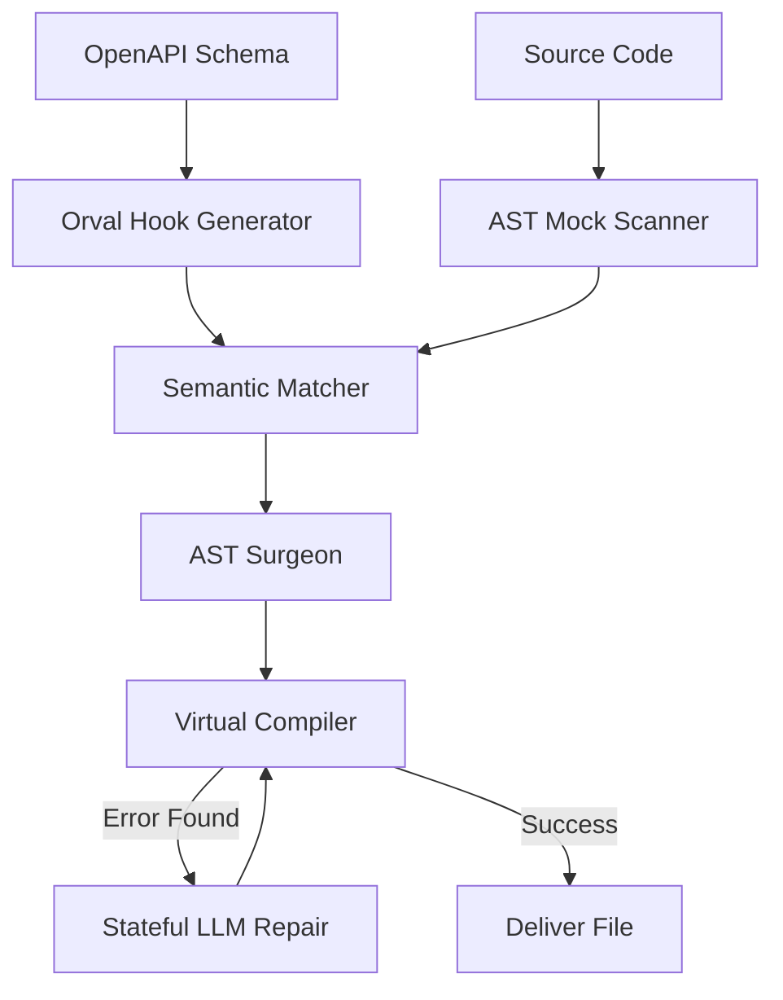

# 🏗️ Binder Architecture Deep Dive

Binder is built on a **Feedback-Driven Transformation Pipeline**. Instead of generating code and hoping it works, Binder treats code generation as an iterative search problem solved by a compiler.

## 🛠️ The Transformation Pipeline

Binder operates in four distinct phases:

### 1. Discovery Phase
- **Backend**: Scans the Python/FastAPI entry point to extract a standard OpenAPI schema.
- **Frontend**: Uses an AST-based **Mock Scanner** to identify data targets (variables like `MOCK_USERS` or generic names like `data`).
- **Hooks**: Uses **Orval** to generate a type-safe client and then performs a secondary AST scan to discover every available `useQuery` and `useMutation` hook.

### 2. Mapping Phase (The Matcher)
Binder uses a high-confidence waterfall to link mocks to hooks:
- **Layer 1: Semantic Shape Matcher**: Compiles the mock object and the API return type. If the keys align (e.g., both have `email` and `uid`), it's a match.
- **Layer 2: Heuristic Matcher**: Uses fuzzy name matching and CRUD pattern detection (e.g., `handleDelete` -> `useDeleteUser`).
- **Layer 3: LLM Broker**: Only triggered for ambiguous cases. The LLM suggests a "Transformer" function if the shapes differ slightly.

### 3. Surgery Phase (The AST Rewriter)
Unlike regex-based tools, Binder uses **TS-Morph** to perform surgical changes:
- **Import Management**: Automatically calculates relative paths and manages named imports.
- **Aliasing**: Uses destructuring aliasing (`const { data: MOCK_DATA } = useHook()`) to minimize changes to your existing JSX logic.
- **Rule Enforcement**: A **Boundary Scanner** detects if hooks are called inside loops/conditionals and proactively moves them to the component root.

### 4. Validation Phase (The Self-Healing Loop)
This is the "Compiler Gate" that ensures 100% reliability:
- **Layer 0 (Type Safety)**: A virtual TypeScript environment compiles the rewritten code.
- **Layer 1 (Shape Integrity)**: Uses the `TypeChecker` to ensure every property access in your UI exists on the API model.
- **Layer 2 (E2E)**: (Optional) Fetches real data to verify structural compatibility.

**The Self-Healing Loop**: If any layer fails, the error + code + history are sent to the LLM. The LLM suggests a fix, which is then re-verified by the loop.

## 📊 Data Flow Graph

## 💾 Persistent Memory
Binder stores successful "Binding Contracts" in `.binder/cache.json`. This acts as a project-specific knowledge base, ensuring that once a data pattern is solved, it is reused instantly without calling the LLM.
