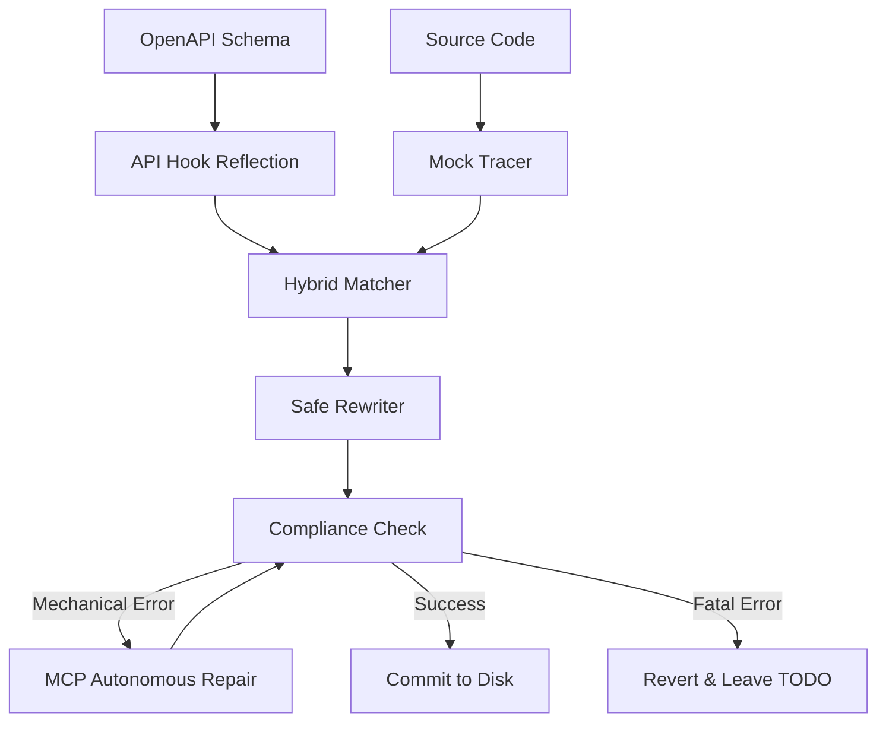

# 🏗️ Binder Architecture Deep Dive

Binder is built on a **Deterministic Transformation Pipeline**. It eliminates hallucinations by replacing generative AI with AST-based analysis and mechanical compliance checks.

## 🛠️ The Transformation Pipeline

### 1. Discovery Phase (The Scout)
- **Repo Mapping**: Crawls the workspace to find `openapi.json` and `tsconfig.json`.
- **API Reflection**: Uses AST analysis to discover every available hook in your generated client, bypassing fragile regex.
- **Mock Tracer**: Follows imports and scans local variables to identify mock data signatures.

### 2. Mapping Phase (Hybrid Matcher)
Binder links mocks to hooks via a dual-match waterfall:
- **Heuristic Matcher**: Uses normalized fuzzy matching and CRUD pattern detection (e.g., `MOCK_USER` -> `useGetUser`).
- **Semantic Shape Matcher**: Compares the data structure of mocks with API return types. If the keys align, confidence is boosted.
- **Global Memory**: If a user manually confirms a match, it is cached globally and auto-applied in the future.

### 3. Surgery Phase (Safe AST Rewriter)
- **Safety Engine**: Detects "Safe Patterns" (direct variable assignment, simple maps). If a pattern is complex (conditionals, multiple transforms), it generates a `TODO(BINDER)` manual review block.
- **AST Surgery**: Uses `ts-morph` for precise changes, preserving hook order and scope.
- **UI Templates**: Injects user-defined loading/error components (e.g., `<Skeleton />`) rather than generic HTML.

### 4. Validation Phase (Compliance Check)
- **Virtual Compiler**: Every rewrite is verified against the user's actual `tsconfig.json`.
- **Autonomous Repair**: If the rewrite has mechanical errors (missing imports), Binder calls an **MCP (Model Context Protocol)** server like `ts-repair` to fix it autonomously.
- **The Revert Gate**: If the file doesn't compile after repair, the change is reverted and flagged for manual review.

## 📊 Data Flow Graph

## 💾 Persistent Memory
Binder stores successful "Binding Contracts" in `.binder/cache.json`. This acts as a project-specific knowledge base, ensuring that once a data pattern is solved, it is reused instantly without calling the LLM.
