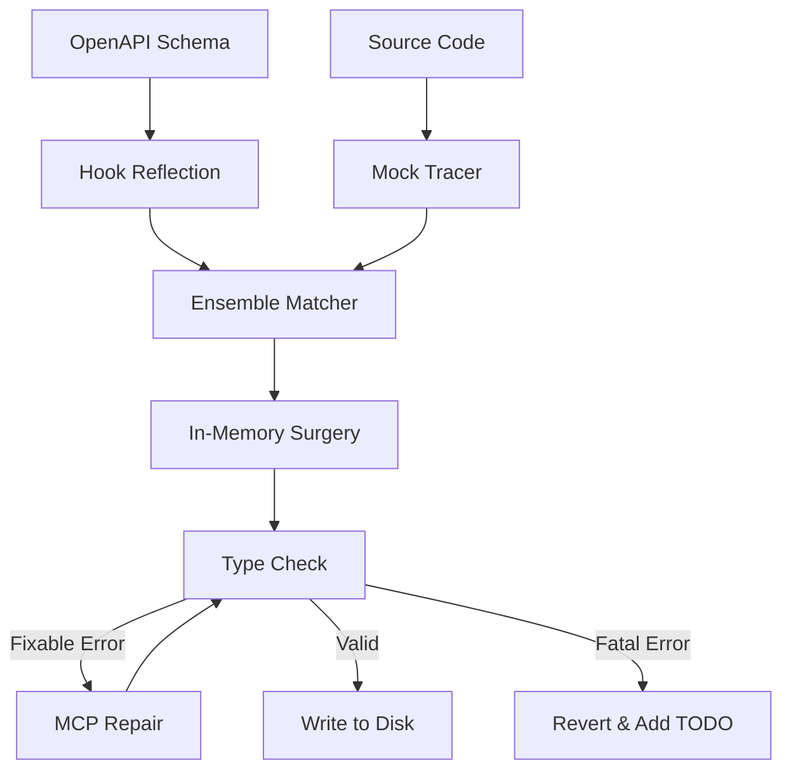
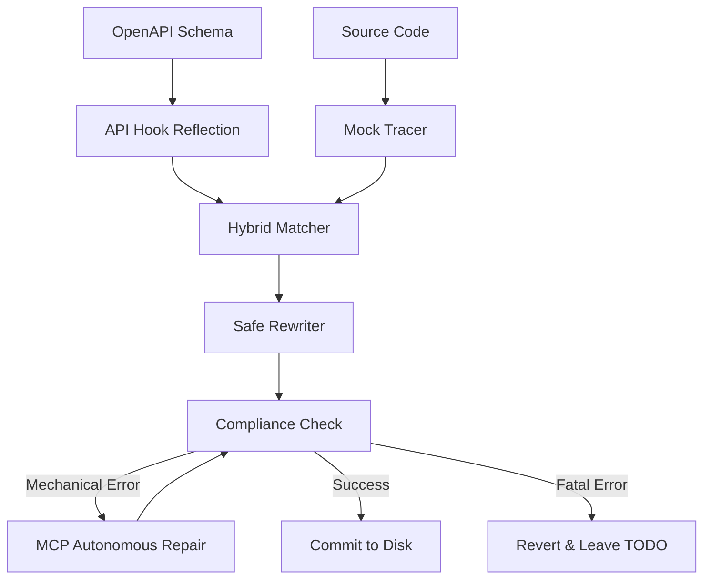

# 🏗️ Binder Architecture

Binder is a **Rule-Based Transformation Engine**. It aims to automate the "plumbing" of frontend-to-backend migrations by combining static analysis with a transactional safety loop.

## 🛠️ The Transformation Pipeline

### 1. Discovery (The Scout)
- **Repo Mapping**: Scans for `openapi.json`, `tsconfig.json`, and project-specific UI components.
- **API Reflection**: Uses AST analysis to list available hooks in the generated client.
- **Mock Tracer**: Identifies local and imported mock data variables using heuristic signatures.

### 2. Matching (Ensemble Engine)
Binder pairs mocks to hooks using a weighted scoring waterfall:
- **Heuristics (35%)**: Name-based fuzzy matching.
- **Semantics (35%)**: Data shape comparison (keys and types).
- **Context (30%)**: Folder structure, file names, and sibling imports.
- **Learning**: Manually confirmed matches are cached globally and prioritized in future runs.

### 3. Surgery (AST Rewriter)
- **Safety Check**: Compares mock usage against known "Safe Patterns."
- **Transactional Rewrite**: Performs changes in memory first using `ts-morph`.
- **Strategy Selection**: Chooses between standard swaps, `useMemo` wrapping, or `useState` migration based on usage.

### 4. Validation (The Safety Gate)
- **Compliance**: Changes are verified against the local `tsconfig.json`.
- **Repair**: Simple errors (e.g., missing imports) are sent to an MCP server for autonomous fixing.
- **Revert**: If the file does not compile after surgery and repair, Binder reverts the change and inserts a `TODO(BINDER)` with the compiler error.

## 📊 Data Flow

## 📊 Data Flow Graph

## 💾 Persistent Memory
Binder stores successful "Binding Contracts" in `.binder/cache.json`. This acts as a project-specific knowledge base, ensuring that once a data pattern is solved, it is reused instantly without calling the LLM.
