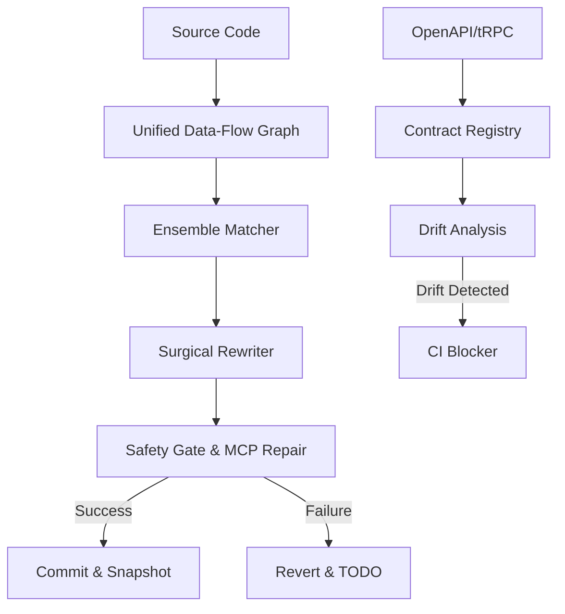

# 🏗️ Binder Architecture

Binder is a **High-Fidelity Contract Engine**. It combines deterministic AST manipulation with a sophisticated version negotiation layer.

---

## 🛠️ The Core Engine

### 1. Unified Data-Flow Graph
Binder doesn't just look at file scopes; it builds a **Global Data-Flow Graph**:
- **Prop Drilling**: Traces JSX attributes through the component tree.
- **Global State**: Understands Redux `dispatch/useSelector` and Zustand `set/useStore` patterns.
- **Unified Result**: Every consumer of a piece of data is identified, ensuring that a "bind" operation updates the entire lifecycle.

### 2. Surgical AST Rewriter
Built on top of `ts-morph`, the rewriter performs transactional changes:
- **Pre-flight Check**: Verifies the target pattern is "safe" for automation.
- **Surgery**: Swaps mock identifiers for API hook results.
- **Post-flight Validation**: Compiles the file in memory. If errors exist, it attempts **Autonomous Repair** via MCP before falling back to a `TODO(BINDER)` revert.

---

## 🛡️ The Sentinel Layer (Contract Fidelity)

### 1. Snapshot Registry
Binder maintains a registry of "Contracts" in `.binder/snapshots/`. Each snapshot is an immutable fingerprint of:
- Backend Schema Hash
- Git Commit SHA
- Verification Status (verified | failed)

### 2. Rollback Intelligence
The dashboard uses a dedicated analysis engine to find the **"Last Known Good"** version by traversing the snapshot history, providing mathematical certainty during incident response.

### 3. Drift Analysis
A structural comparison engine that maps frontend API usages (found via AST scanning) against the current OpenAPI or tRPC definitions.

---

## 📊 System Overview

---

## 💾 Storage & Cache
- **.binder/cache.json**: Remembers human-confirmed bindings to accelerate future migrations.
- **.binder/snapshots/**: The source of truth for version compatibility.
- **.binder/patterns/**: User-defined templates for code scaffolding.
